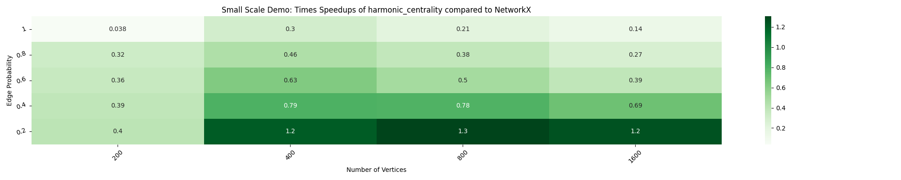
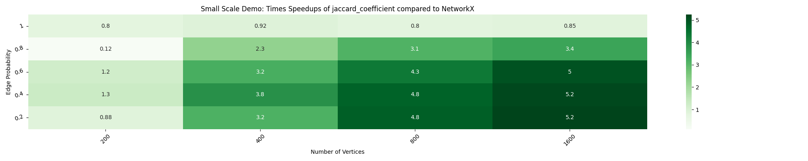

# Blog4
## Week 7-8 (14th June to 27th July, 2025)

### Abstract

In Weeks 7–8, I worked on adding Harmonic Centrality and Link Prediction algorithms to nx-parallel, trying to tackle performance bottlenecks involving pickling and chunking. I also added tests for previously added `should_run` functionality. I improved ASV benchmarks and roughly planned new parallel implementations of algorithms.

### 1. Parallelising Harmonic centrality

In [PR#124](https://github.com/networkx/nx-parallel/pull/124), I implemented harmonic centrality algorithm in nx-parallel. I first aligned the parallel version with NetworkX’s structure and optimized how chunks are processed, avoiding unnecessary set intersections. Upon implementation, the heatmaps I obtained did not yield any speedups at all:

To tackle performance bottlenecks, I experimented with strategies like limiting chunk sizes and varying `n_jobs`, reached a a conclusion that the main slowdown comes from passing large graphs between cores. I also explored alternative ways to speed up the computation, like replacing the shortest path function with `all_pairs_bellmann_ford_path` and investigating whether memory mapping could help reduce data transfer overhead. Although this PR gives a draft implementation of Harmonic Centrality, I am currently working on different ways to improve the speedups. Alongside this, I raised a PR in NetworkX with an optimisation (i.e redundant use of set intersection) to harmonic centrality and uploaded benchmarks to demonstrate the impact.

### 2. Parallelising Link Prediction algorithms

In [PR#127](https://github.com/networkx/nx-parallel/pull/127), I focused on parallelizing link prediction algorithms in nx-parallel. I started by drafting the parallel Jaccard coefficient implementation and explored whether using `return_as=generator` could work, but ruled this out since it would result in a non-deterministic output order. Digging deeper, I learned why generators can’t be pickled, which clarified why returning a generator from the chunk process function isn’t viable. I also handled edge cases like `edge_probability=1`, where `nx.non_edges` returns empty -- adding an early exit condition improved efficiency. After finalizing the implementation of Jaccard coefficient, I extended the approach to other link prediction measures and tested them with the timing script, observing clear speedups for the algorithms.

I added community-based link prediction algorithms, and benchmarked them with setup functions to avoid skewing timings with community assignments inside the timed block. One key challenge I’m still tackling is the mismatch between lazy error raising (as expected from generators) in Networkx implementation and parallel chunks being evaluated eagerly in nx-parallel, causing exceptions to appear sooner than they should. I also raised [PR#129](https://github.com/networkx/nx-parallel/pull/129) to add a separate test in `test_get_chunks` for these community-based link prediction algorithms where I assigned community labels to each node in the graph and tested the implementation against both the default chunking and random chunking strategies.

### 3. Adding tests for `should_run`

I also spent time this week adding the `should_run` test coverage in nx-parallel [PR#123](https://github.com/networkx/nx-parallel/pull/123). I reviewed the existing flow of `should_run` checks, looked into how similar logic is handled in nx-cugraph for inspiration (although it wasn't much useful), and resolved multiple attribute and assertion errors that came up while writing new tests. To make this robust, I added a utility using `inspect` to automatically find all functions in nx_parallel algorithms that define a custom `should_run` property, so we can test them systematically. The tests verify that each `should_run` returns a valid type (bool or str), and I brainstormed additional edge cases to cover different graph scenarios in the future. These `should_run` checks decide whether an algorithm should actually run, depending on the graph or backend.

### 4. Refactor ASV Benchamrks

I worked on improving the benchmarks in nx-parallel by adding a setup function [PR#126](https://github.com/networkx/nx-parallel/pull/126). Following the [asv documentation](https://asv.readthedocs.io/en/stable/writing_benchmarks.html), I refactored the benchmarks to handle different graph types for weighted and unweighted graphs, directed and undirected graphs and centralized the random seed for consistency. 
The setup function ensures graph construction time doesn’t affect the runtime measurements, which makes results clearer and fairer — especially for algorithms involving tournaments, `_apply_prediction` and `number_` algorithms that don't really benefit from pre-built graphs (since cached graph uses a different type of graph). While doing this, I also realized that the use cases for Python benchmarks and ASV benchmarks differ: ASV is better for tracking performance changes over commits, while Python benches are more practical for comparing backends side by side. Another takeaway was that we don’t have a clear estimate yet on how long ASV should stay in focus in nx-parallel — so while merging these setup improvements makes sense, I was recommended that it’s probably not worth spending much more time on surface-level asv tweaks for now.

### 5. Additional Work done 

1. Working on parallel implementations of clustering and average neighbor degree -- I plan to raise PRs for both soon.
2. Addressed review comments and improved the logging example in [PR#122](https://github.com/networkx/nx-parallel/pull/122).
3. Preparing separate benchmarks for `is_reachable()` for reachable and unreachable case in [Issue#8155](https://github.com/networkx/networkx/issues/8155) in NetworkX -- I plan to raise a PR for this as well.
