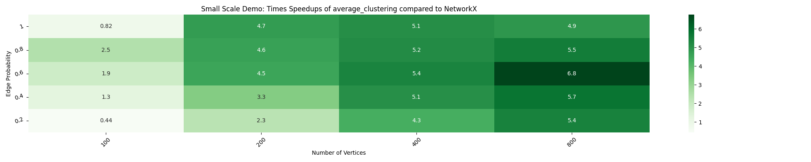
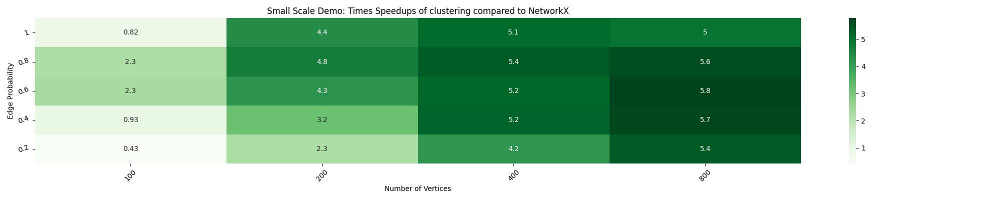
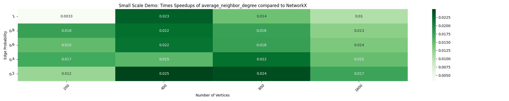
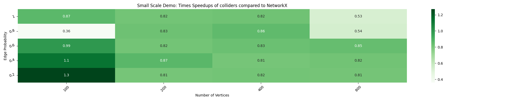
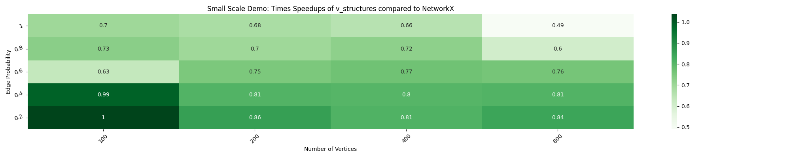

# Blog5
## Week 9-10 (28th July to 10th Aug, 2025)

### Abstract

In weeks 9 and 10 of my coding phase, I focused on centralizing the `should_run` logic to reduce redundancy and streamline the decision of when to skip parallel execution. I also implemented and benchmarked several graph algorithms (`clustering`, `average_clustering`, `average_neighbor_degree`, `v_structures`, and `colliders`) to explore their parallel performance. While some algorithms achieved moderate speedups, others suffered from overheads that negated parallel benefits, reinforcing the need for the centralized `should_run` checks. Additionally, I enhanced testing utilities to support new algorithms with diverse behaviors, extending the test suite. 

### 1. Centralising `should_run`

In the previous implementation of the `should_run` function, each algorithm had its own `should_run` logic defined. In most cases, the logic was identical, leading to redundant code. To address this, I worked on centralizing the `should_run` logic this week in [PR #123](https://github.com/networkx/nx-parallel/pull/123).

The new approach defines a set of reusable `should_run` functions for scenarios where the parallel backend should be skipped, falling back to the next available priority backend, such as:
    - When speedups are less than 1 i.e., the NetworkX backend outperforms the parallel backend due to overhead.
    - For graphs with fewer than 200 nodes, where the overhead outweighs the benefits of parallelism.
    - When the number of cores is None, 0, or 1, defeating the primary purpose of parallelism.

While adding a `should_run` condition based on core count was initially seen as potentially restrictive, we agreed there’s little benefit in using the parallel backend under these skip conditions.

The `_configure_if_nx_active` decorator now accepts a `should_run` argument instead of requiring each algorithm to define one internally. By default, it applies a `should_run` function that determines whether to run in parallel based on the configured number of cores. If a custom `should_run` function is passed, it overrides the default behavior.

This optimisation reduces code redundancy, and makes it straightforward to add `should_run` checks for new algorithms without repeating boilerplate.

### 2. Adding more algorithms

2.1 `clustering`

I implemented the `clustering` and `average_clustering` in [PR#130](https://github.com/networkx/nx-parallel/pull/130). Initially, the `clustering` implementation showed no speedup over the sequential version, regardless of the number of workers-- the bottleneck was that all the heavy lifting was still executed sequentially. I restructured the code to distribute computation across cores and resolved a few edge cases.

_Heatmap for reference:_

2.2 `average_clustering`

For `average_clustering`, I explored three possible approaches:  
1. Parallelise `average_clustering` while using NetworkX’s sequential `clustering`.  
2. Use NetworkX’s `average_clustering` but plug in the parallel `clustering` implementation.  
3. Parallelise `average_clustering` and also use parallel `clustering` (nested parallelism).  

Running the timing script showed that approaches (1) and (2) achieved similar speedups. I discarded (3) due to concerns about nested parallelism and potential core oversubscription (ref. [nested parallelism](https://stackoverflow.com/questions/4317551/openmp-what-is-the-benefit-of-nesting-parallelizations)). While (3) produced similar speedups to (1) and (2) in my tests, this was more of a precautionary decision to avoid performance degradation for graphs with much larger node counts.

Between the remaining two, I chose (1) as it best aligns with nx-parallel’s design philosophy of applying parallelism at the top-level algorithm rather than within nested calls.

_Heatmap for reference:_

2.3 `average_neighbor_degree`

I worked on `average_degree_neighbor` in [PR# 132](https://github.com/networkx/nx-parallel/pull/132). The parallel version did not yield any speedups. I initially tested it with varying `n_jobs` values-- showed no improvement-- in fact, performance degraded as the number of workers increased. This was because the computation per chunk was too small to offset the parallelisation overhead and running the timing script across cores confirmed this. I even experimented by setting a maximum chunk size, but this still failed to produce better results. Once the `should_run` PR is merged, I plan to integrate it here so that the parallel backend is skipped entirely, allowing NetworkX’s much faster sequential version to run instead.

_Heatmap for reference:_

2.4 `v_structures` and `colliders`

I worked on a previously raised PR (ref. [#74](https://github.com/networkx/nx-parallel/pull/74)) that implemented v_structures and colliders, but it was closed earlier because it yielded less than 1× speedups. I wanted to see if there was any way to improve performance, so I explored a few different strategies.

I experimented with joblib’s [memory-mapping](https://joblib.readthedocs.io/en/latest/parallel.html#working-with-numerical-data-in-shared-memory-memmapping:~:text=shared%20memory%20(memmapping)-,%C2%B6,-By%20default%20the) to address possible memory bottlenecks, with the idea that passing large graph objects between processes might be the culprit. However, the memory-mapped NumPy-based approach actually performed worse. The overhead of converting the graph into a matrix and maintaining node2label / label2node mappings outweighed any potential gains. Looking back, the main reason for the lack of speedups seems to be that the cost of passing large graph structures across processes far exceeds the work done per chunk. 

I also experimented with changing return types—yielding a generator vs. returning a list. I ultimately kept it as a generator to maintain compatibility with NetworkX’s implementation and to lazily generate results instead of storing large 3-tuples in memory.

Running the timing script for graphs with 1600 nodes further highlighted memory issues-- the process would either be killed or appear to leak memory due to the huge number of combinations generated, specifically storing all possible 3-node tuples in memory.

Despite trying these approaches, the minimal per-item computation and lack of speedup indicate that we should apply the `should_run` mechanism to skip the parallel backend in this case, since NetworkX’s sequential implementation is faster. I plan to add this once the `should_run` (ref. [PR#123](https://github.com/networkx/nx-parallel/pull/123)) feature is merged.

_Heatmaps for reference_

### 3. Modify `test_get_chunks` to accomodate new algorithms:

I worked on enhancing `test_get_chunks` to accommodate all the new algorithms introduced, in [PR#129](https://github.com/networkx/nx-parallel/pull/129). Each algorithm had its own quirks that made it incompatible with the existing implementation-- for example, some algorithms failed with undirected graphs, some returned lists that needed to be sorted before comparing outputs across random and default chunking, and some required a fallback execution when the primary attempt failed (the introduction of a try–except block).

Along the way, I focused on reducing code redundancy by replacing multiple hard-coded lists for each edge case with a simpler unified structure. The changes aim to make the test more adaptable, and easier to extend as new algorithms are added. This update is currently awaiting review.

### Other contributions:

- Merged [PR#128](https://github.com/networkx/nx-parallel/pull/128/) - refactor `test_get_functions_with_get_chunks`
- Merged [PR#133](https://github.com/networkx/nx-parallel/pull/133) - move `assign_algorithms` logic outside BackendInterface
- Merged [PR#8170](https://github.com/networkx/networkx/pull/8170) - use `pytest.raises` as a context
