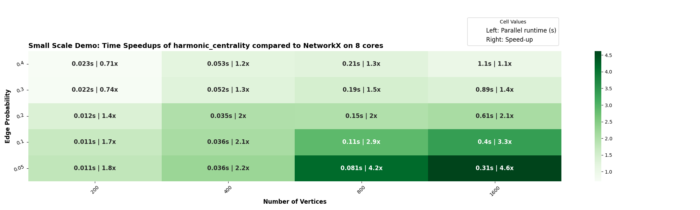
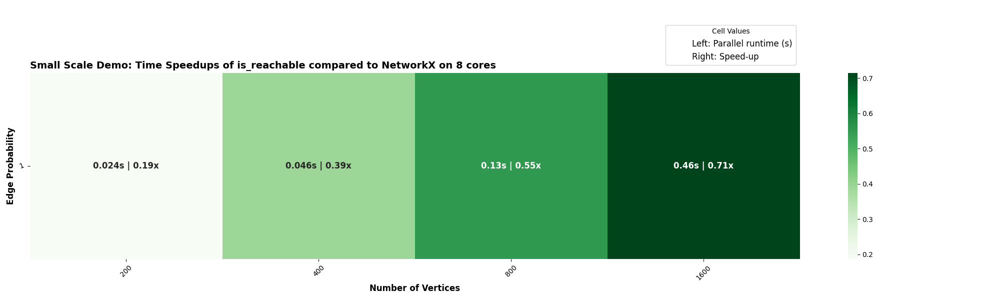
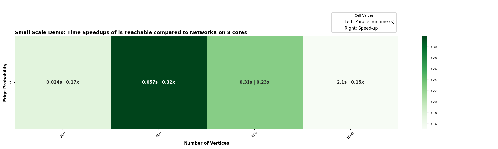

# Blog6
## Week 11-12 (11th Aug to 24th Aug, 2025)

### 1. Expanding `should_run`

In the previous blog, I introduced the `should_run` functionality to decide whether a backend should run a particular algorithm. Over the past two weeks, I built a test suite where I created dummy functions and decorated them with different `should_run` policies to verify the tests.

Additionally, I implemented a new policy called `should_run_if_sparse`, which evaluates the graph density before deciding whether an algorithm should execute on the parallel backend.

### 2. `harmonic_centrality` showing speedups for sparse graphs

While benchmarking `harmonic_centrality`, we noticed that speedups were most prominent for sparse graphs, particularly when the edge probability was around `p = 0.2`. This raised an important question about our benchmarking scheme. Currently, we test algorithms on graphs generated with edge probabilities `p = 0.2, 0.4, 0.6, 0.8, 1.0`. While this evenly spreads values between 0 and 1, it doesn’t accurately represent real-world networks, which are typically sparse. This is an ongoing discussion in [Issue#136](https://github.com/networkx/nx-parallel/issues/136).

Another key decision to make was: When should `should_run` return true? For this, I experimented using binary search across edge probabilities. The results showed that a density threshold of `0.3` works well. Below this, parallel execution consistently yields speedups; above it, the gains taper off. So, a new `should_run_if_sparse` policy was added. It evaluates density as follows:

$$
\text{density} = \frac{2m}{n(n-1)}
$$

where m is the number of edges and n is the number of nodes.
- If density < threshold → run with the parallel backend.
- Otherwise → skip parallel execution and move to the next backend in the priority chain.

You can see from the heatmap below that speedups occur primarily for sparse graphs, confirming that the chosen density threshold aligns well with actual performance gains:

### 3. Additional work done

- Re-ran and reorganized old vs. new heatmaps using the updated timing script.
- Added `should_run` checks for algorithms that showed minimal speedups (< 1), including:
    - `number_` algorithms
    - `v_structures` and `colliders`
    - `average_neighbor_degree`
    - `is_reachable`: 
        With the recent NetworkX updates, `is_reachable` no longer shows significant speedups. To better understand its performance, I compared two different parallel implementations:
        
        Mem-mapping approach – showed slightly better results overall:
        

        Pure Python parallel approach – lagged behind the mem-mapped version:
        

        Based on these results, the mem-mapping approach appears to be the better choice for `is_reachable` moving forward.
- Working on adding `local_reaching_centrality` and `global_reaching_centrality` algorithms in the next few days.

### 4. PRs Status

- Got the below PRs merged:

    - Under Review: [PR#141](https://github.com/networkx/nx-parallel/pull/141)
    - Merged: [PR#106](https://github.com/networkx/nx-parallel/pull/106)
    - Merged: [PR#114](https://github.com/networkx/nx-parallel/pull/114)
    - Merged: [PR#117](https://github.com/networkx/nx-parallel/pull/117)
    - Merged: [PR#119](https://github.com/networkx/nx-parallel/pull/119)
    - Merged: [PR#122](https://github.com/networkx/nx-parallel/pull/122)
    - Merged: [PR#123](https://github.com/networkx/nx-parallel/pull/123)
    - Merged: [PR#124](https://github.com/networkx/nx-parallel/pull/124)
    - Merged: [PR#126](https://github.com/networkx/nx-parallel/pull/126)
    - Merged: [PR#127](https://github.com/networkx/nx-parallel/pull/127)
    - Merged: [PR#129](https://github.com/networkx/nx-parallel/pull/129)
    - Merged: [PR#132](https://github.com/networkx/nx-parallel/pull/132)
    - Merged: [PR#134](https://github.com/networkx/nx-parallel/pull/134)
    - Merged: [PR#135](https://github.com/networkx/nx-parallel/pull/135)
    - Merged: [PR#138](https://github.com/networkx/nx-parallel/pull/138)
    - Merged: [PR#130](https://github.com/networkx/nx-parallel/pull/130)

I’m glad that I was able to implement everything I had planned during this coding period. I look forward to continuing my contributions to nx-parallel and NetworkX, and I’m truly grateful for this incredible opportunity and for the time, guidance, and support from my mentors.

